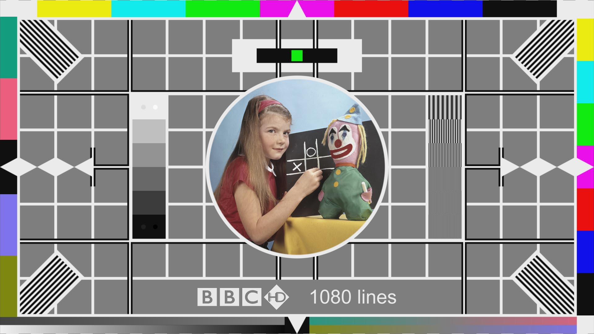

2017-01-03 10:00

A paragraphs of text. ere is a graduation programme with two sections, one for the list of people graduating, and one for the description of the ceremony. (The markup in this example features an uncommon style sometimes used to minimize the amount of inter-element whitespace.)

Examples of sections would be chapters, the various tabbed pages in a tabbed dialog box, or the numbered sections of a thesis. A Web site's home page could be split into sections for an introduction, news items, and contact information.

* Some l
* list
* items

    code
    more code
    
>The article element represents a complete, or self-contained, composition in a 
>document, page, application, or site and that is, in principle, independently 
>distributable or reusable, e.g. in syndication. This could be a forum post, a 
>magazine or newspaper article, a blog entry, a user-submitted comment, an 
>interactive widget or gadget, or any other independent item of content.

